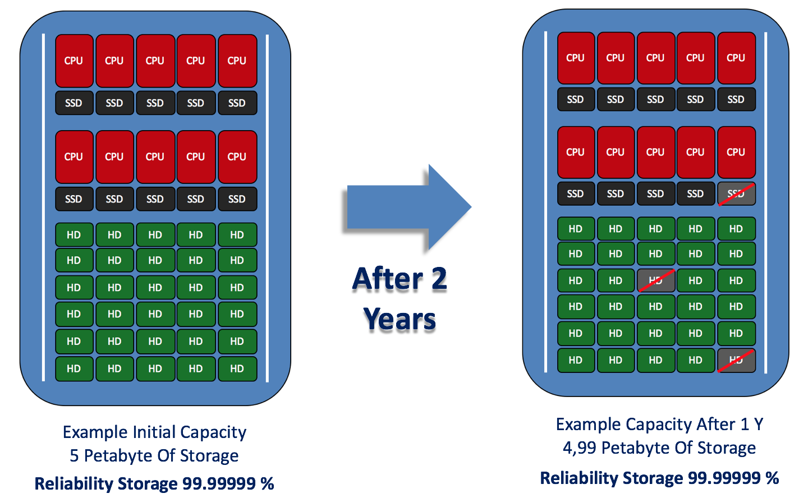
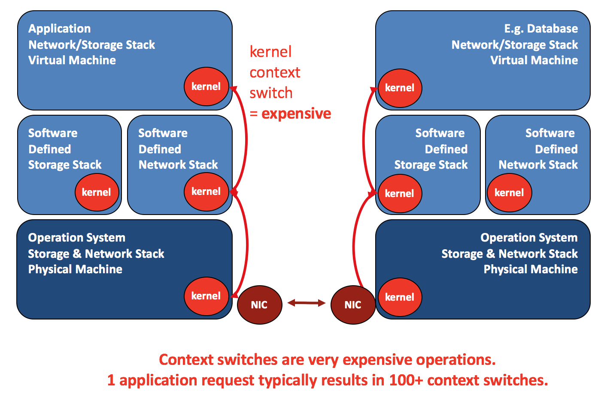
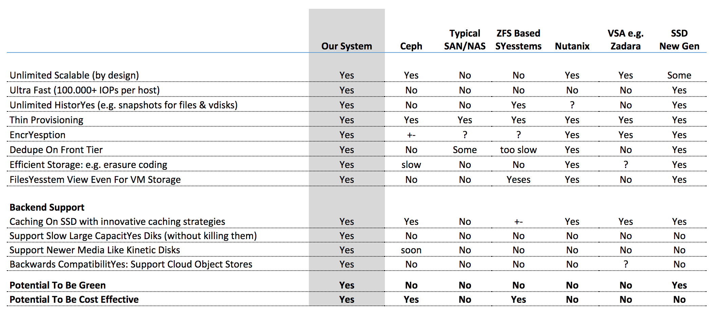
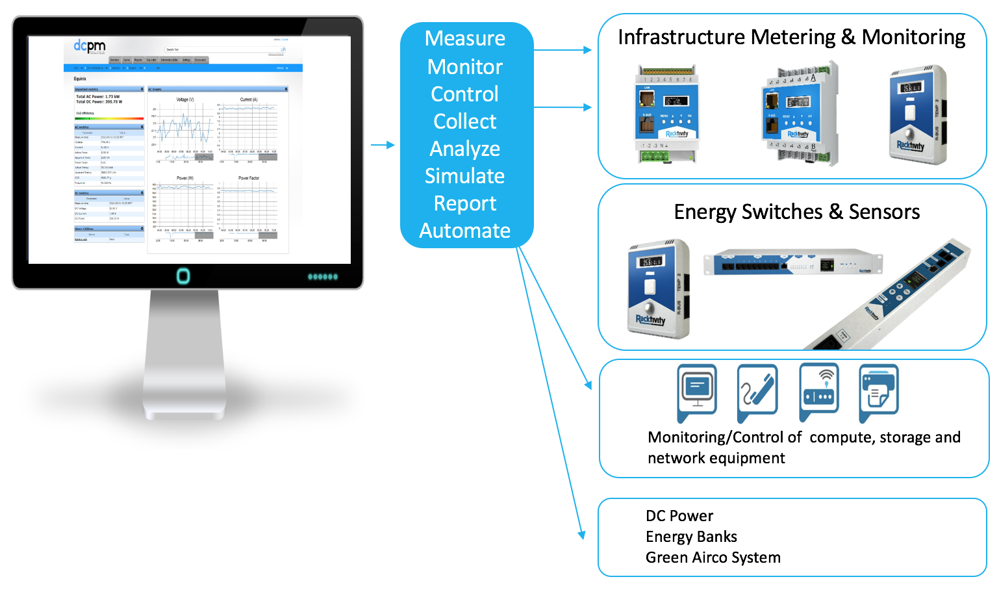

+++
title = "How Did We Remove Complexity"
+++

### Zero Complexity

IT as Energy is driven by the elimination of complexity and removing all obsolete layers of legacy technology. Our racks are developed from the ground up using our 15 years of software, hardware, storage and networking experience. We achieve to make IT less costly and more performant:

- Significant lower total cost of ownership
- Increase of the overall IT performance
- Reduction of power consumption

#### Zero Touch
Elimination of management and system handling. We believe in extreme automation and innovation in order to simplify your IT. Capacity is always available and scalable without need for touch.

- On demand capacity is always available
- No need to touch or replace any hardware
- Self-healing capability removes management

#### Zero Networking

There is a lot of overhead in how network packets travel over clouds, we have drastically improved this resulting in lot lower latencies and less hardware requirements.

#### Zero Storage

Elimination of independent and expensive storage technology as ou storage racks have integrated filesystem interfaces and can both do high performance storage and long-term retention for digital archives.

- No need to buy expensive storage area networks
- Flawless integration into your secure networks
- No limits to scalability, 100s of petabytes

#### Zero Downtime

Your IT infrastructure is business-critical and demands ultra-reliable technology with 100% uptime.

- Predicts when components might fail
- Prevents serious failures and outages
- Protects your business IT workloads

#### Zero Desktop

Elimination of desktops due to the evolution of cloud workspaces. Our technology centralizes your apps and secures the data from creating temporary user containers which are destroyed once users log-off.

- Lowers cost of application licenses
- Centralizes and secures all data
- Secure access from any device, anywhere

